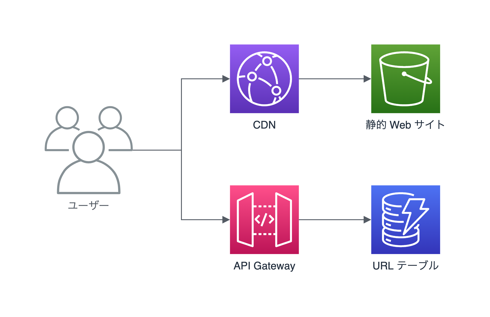

# AWS で作る URL 短縮サービス



- 使用サービス
  - バックエンド
    - API Gateway: 統合、検証、マッピング
    - DynamoDB: URL データベース
  - フロントエンド
    - CloudFront: HTTPS 公開
    - S3: 静的コンテンツのホスト
- 使用言語、フレームワーク
  - Node.js(pnpm), Typescript
  - CDK, React, Vite, Cloudscape

## 構築してテストする

1. 依存パッケージをインストール

```
pnpm install
```

2. API をデプロイ

```
cd backend/
cdk deploy TinyUrlApiStack
```

_出力から API エンドポイント名をコピー_

3. API エンドポイントを設定

   - `frontend/src/config.ts` の API_ENDPOINT をコピーした値に編集

4. フロントエンドをローカル実行

```
cd frontend/
pnpm run dev
```

5. ブラウザが開くのでアクセスしてテストする

## (オプション) 公開する

1. フロントエンドをビルド

```
cd frontend/
pnpm run build
```

2. S3 に配置して CloudFront で公開

```
cd backend/
cdk deploy TinyUrlHostingStack
```

## 削除

```
cd backend/
cdk destroy --all
```
